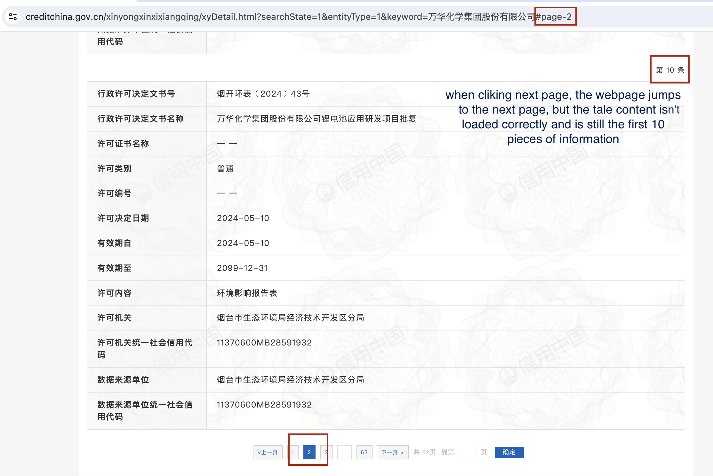

# Assignment: Web Crawler for '万华化学集团股份有限公司'

## 1 Introduction

This code demonstrates how to extract data from a specific webpage.

1. When the code runs, it will automatically open a Google Chrome browser and navigate to the URL containing the information for the target company.
2. After manually entering the captcha, the code will wait for the administrative license data to load.
3. Once the data is loaded, the system will start extracting the data from the current page.
4. After extracting the data from the current page, it will automatically click the "Next Page" button and continue extracting data.
5. It is important to note that after clicking the "Next Page" button, the system will wait until it confirms that the table content has changed and the new table has fully loaded before continuing with the extraction task.
6. If the table content does not change or the new table fails to load, the extraction process will stop, and an error will be reported.
7. The extracted data will be saved into a CSV file in the specified format.

## 2 Code

```python
import undetected_chromedriver as uc
from selenium.webdriver.chrome.options import Options
from selenium.webdriver.common.by import By
from selenium.webdriver.support.ui import WebDriverWait
from selenium.webdriver.support import expected_conditions as EC
import pandas as pd
import time

# Set up Chrome options
chrome_options = Options()

# Start undetected_chromedriver
browser = uc.Chrome(options=chrome_options)

# Open target webpage
url = "https://www.creditchina.gov.cn/xinyongxinxixiangqing/xyDetail.html?searchState=1&entityType=1&keyword=%E4%B8%87%E5%8D%8E%E5%8C%96%E5%AD%A6%E9%9B%86%E5%9B%A2%E8%82%A1%E4%BB%BD%E6%9C%89%E9%99%90%E5%85%AC%E5%8F%B8"
browser.get(url)

# Wait for the table to load on the page
try:
    element_present = EC.presence_of_element_located((By.CLASS_NAME, 'result-table'))
    WebDriverWait(browser, 30).until(element_present)
except Exception as e:
    print(f"Timeout or error waiting for page to load: {e}")

# Create an empty DataFrame to store all data
all_data_df = pd.DataFrame(columns=[
    "Company_name", "authority", "start_year", "start_date", "end_year", "end_date", "permit_type", "permit_certificate", "permit_decision_name"
])

# Function to extract table data from the current page
def extract_table_data():
    page_data = []  # Store data from the current page
    tables = browser.find_elements(By.CLASS_NAME, 'result-table')
    for table in tables:
        rows = table.find_elements(By.TAG_NAME, 'tr')
        row_data_dict = {}
        for row in rows:
            cols = row.find_elements(By.TAG_NAME, 'td')
            if len(cols) == 2:  # Ensure data completeness
                key = cols[0].text.strip()
                value = cols[1].text.strip()
                row_data_dict[key] = value
        if len(row_data_dict) > 0:
            company_name = "万华化学集团股份有限公司"
            authority = row_data_dict.get('许可机关', '')
            start_year = row_data_dict.get('有效期自', '')[:4]
            start_date = row_data_dict.get('有效期自', '')
            end_year = row_data_dict.get('有效期至', '')[:4]
            end_date = row_data_dict.get('有效期至', '')
            permit_type = row_data_dict.get('许可类别', '')
            permit_certificate = row_data_dict.get('许可证书名称', '')
            permit_decision_name = row_data_dict.get('行政许可决定文书名称', '')
            
            page_data.append({
                "Company_name": company_name,
                "authority": authority,
                "start_year": start_year,
                "start_date": start_date,
                "end_year": end_year,
                "end_date": end_date,
                "permit_type": permit_type,
                "permit_certificate": permit_certificate,
                "permit_decision_name": permit_decision_name
            })
    print(f"Extracted data: {page_data}")
    return page_data  # Return data from the current page

# Extract data from the first page
page_data = extract_table_data()
all_data_df = all_data_df.append(page_data, ignore_index=True)

# Loop to click "Next Page" button and extract data
while True:
    try:
        # Find and scroll to the "Next Page" button
        next_button = WebDriverWait(browser, 30).until(
            EC.element_to_be_clickable((By.LINK_TEXT, '下一页 >'))
        )
        
        current_table_data = browser.find_element(By.CLASS_NAME, 'result-table').text

        # Use JavaScript to scroll to the "Next Page" button
        browser.execute_script("arguments[0].scrollIntoView();", next_button)
        
        # Wait 5 seconds before each click
        time.sleep(5)
        
        next_button.click()
        
        # Wait for the table content to change
        WebDriverWait(browser, 20).until(
            lambda browser: browser.find_element(By.CLASS_NAME, 'result-table').text != current_table_data
        )

        # Wait for the new table to load
        WebDriverWait(browser, 20).until(
            EC.presence_of_element_located((By.CLASS_NAME, 'result-table'))
        )

        # Extract data from the current page
        page_data = extract_table_data()
        all_data_df = all_data_df.append(page_data, ignore_index=True)

    except Exception as e:
        print(f"No more pages or error: {e}")
        break

# Save all extracted data to a CSV file
csv_filename = 'extracted_data.csv'
all_data_df.to_csv(csv_filename, index=False, encoding='utf-8-sig')

# Print all extracted data
for table_index, table_data in all_data_df.iterrows():
    print(f"Table {table_index + 1}:")
    print(table_data.to_dict())
    print("\n")

# Close the browser
# browser.quit()
```

## 3 Discussion and Current Problem

### (a) CAPTCHA

When crawling web data, I found that the company's website requires entering a captcha. If you stay on the page too long without any action, you'll need to enter a captcha again when interacting with the webpage (like clicking "Next Page"). This code uses manual captcha entry.

I also found several other methods:

1. **Training a Machine Learning Model** to recognize captcha images: I think this method is unsuitable because training takes a large amount of time and may not be accurate.
2. **Using a Headless Browser** : I have already tried and it didn't work.
3. **CAPTCHA Solving Services** : These services fee can be expensive so I don't recommend.

### (b) Current Ploblem

The webpage often fails to load, or there is no response after clicking to go to the next page (even if I did these actions manually). The maximum continuous extraction was 8 pages, but it got stuck on the ninth page. I'm not sure if it's the problem about my computer or network. Maybe you can run this code to see if it can extract the data correctly.


### (c) PDF Information Extraction VS Web Crawler

- Downloading PDFs from websites is usually easier. However, converting PDFs to text can cause some data loss or mistakes.
- Web Crawler provides more structured and organized data. But it requires manual captcha entry, preventing full automation, and can face issues with resources not loading correctly.


